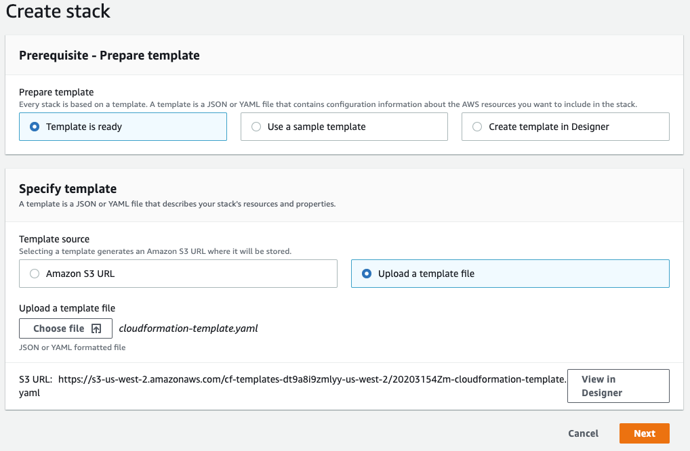
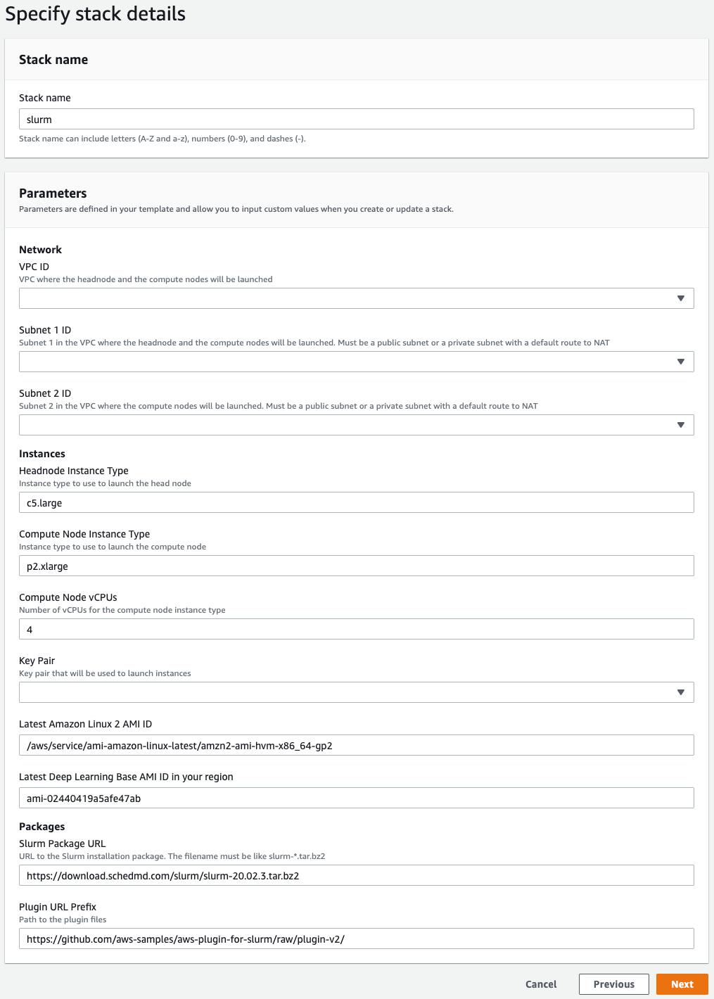

# Parallelizing Weights & Biases' Sweeps module on Slurm

Weights & Biases (W&B) provides a number of tools that make tracking machine learning (ML) models a lot easier. One of their most popular tools is their Sweeps module that allows you to easily perform state-of-the-art hyperparameter optimization techniques across many machines in parallel using `wandb.agent()`. Many academic researchers have access to high performance computing (HPC) clusters that utilize a Slurm job scheduler, but spinning up multiple W&B agents on multiple nodes within a Slurm job is not straightforward. Let me walk you through how to do just that.

This walkthrough has three parts:

1. Setting up your own burstable Slurm cluster on Amazon Web Services (AWS) using their [aws-plugin-for-slurm](https://github.com/aws-samples/aws-plugin-for-slurm/tree/plugin-v2).
2. Initiating and scaling a W&B Sweep across multiple nodes on Slurm.
3. Adding Slurm nodes to a previously initiated W&B Sweep.

NOTE: if you just want to run a single agent (i.e. a single thread on a single node), then your task is much simpler. Just run `sweepid = wandb.sweep(config); wandb.agent(sweepid)` in your submitted job and you're good to go.

# Setting up your own Slurm cluster on AWS

<details>
<summary>Click to expand</summary>

Note: if using specialized AWS instances for the first time (such as the P-family GPU instances) you must [request a service limit increase](http://aws.amazon.com/contact-us/ec2-request). The number of nodes you request should be at least equal to the number of nodes you'll make available to your Slurm cluster (more below).

AWS offers a great [plugin](https://github.com/aws-samples/aws-plugin-for-slurm/tree/plugin-v2) that greatly simplifies the process of creating your own burstable Slurm cluster. This cluster will constantly run a 'headnode' that runs the Slurm daemon (manages the job queue and spins up resources) and a cron job that pulls down unused resources. Your jobs will be run on compute nodes that are spun up when needed and torn down when not used, saving you money. The plugin also offers other cool abilities, like the ability to extend an existing cluster giving you more compute power or specialized hardware when needed, or the ability to specify partitions that only use spot instances which saves you even more money. I will not get into these cool features, but you can read more about it via their [README](https://github.com/aws-samples/aws-plugin-for-slurm/tree/plugin-v2/README.md).

Let's get started:

We will be setting up our cluster via a CloudFormation template, a yaml or json file that specifies exactly what we want in our cluster. This template is courtesy of the plugin above and requires a few inputs:
- a Virtual Private Cloud (VPC)
- two subnets in the VPC but in different availability zones
- a headnode instance type
- a compute node instance type
- an SSH key
- the ID for the latest Deep Learning Base AMI in your region ([found here](https://aws.amazon.com/marketplace/pp/B07NMRZ463))

Your AWS account comes with a default VPC and defaults subnets on every availability zone which you are more than welcome to use. If you want to set up new ones, you may follow the optional instructions below.


## \[OPTIONAL\] Create a dedicated VPC and subnets via the AWS CLI

[Install the aws2 cli](https://docs.aws.amazon.com/cli/latest/userguide/install-cliv2.html) on your local machine.

In your terminal:

1. Login to to the CLI: `aws configure`
2. Create a VPC: `aws2 ec2 create-vpc --cidr-block 10.0.0.0/16`
3. Create subnet 1: `aws2 ec2 create-subnet --vpc-id [VPC_ID] --cidr-block 10.0.0.0/20 --availability-zone [AVAILABILITY_ZONE_1]`
    - VPC_ID should be the ID of the previously created VPC, you can use `aws2 ec2 describe-vpcs` to show all of the VPCs
    - AVAILABILITY_ZONE_1 is dependent upon your region but should be something like 'us-west-2a'
4. Create subnet 2: `aws2 ec2 create-subnet --vpc-id [VPC_ID] --cidr-block 10.0.16.0/20 --availability-zone [AVAILABILITY_ZONE_2]`


## Create your HPC stack with CloudFormation via the AWS Console

Download the CloudFormation template: `wget -q https://github.com/elyall/wandb_on_slurm/raw/main/aws/cloudformation-template.yaml`

Then edit the `cloudformation-template.yaml` to your liking. For instance you can change the maximum number of nodes allowed in your cluster at line 323, or the size of your headnode's filesystem where all of the compute nodes access your code at line 234. 

Next we'll create an SSH key ([documentation](https://docs.aws.amazon.com/AWSEC2/latest/UserGuide/ec2-key-pairs.html)):

1. Go to the [AWS Console](console.aws.amazon.com/console/home), click "Services" at the top left and type in or select "EC2".
2. Hit the "Key pairs" link under "Network & Security" on the left.
3. Select "Create key pair" at the right.
4. Enter a name for your key (e.g. aws-ssh-key), then hit "Create key pair" at the bottom right.
5. Save the private key file to a secure folder on your local machine (i.e. not in a git repo that will be pushed, not in a shared folder, etc.).

Next we'll setup your stack:

1. Go to the [AWS Console](console.aws.amazon.com/console/home), click "Services" at the top left and type in or select "CloudFormation". 
2. Hit the "Create Stack" dropdown on the right side, then select "With new resources (standard)".
3. Under "Specify Template" click "Upload a template file", then hit "Choose file" and upload the `cloudformation-template.yaml`. 

Hit "Next".



1. Enter a "Stack Name" such as "slurm".
2. Select your VPC from the dropdown. (Note: the stack and VPC have to be in the same region)
3. Select two different subnets on different availability zones with the next two dropdowns.
4. Change the Headnode or Compute Node Instance Type if you wish to another [offered on EC2](https://aws.amazon.com/ec2/instance-types/). Make sure the value under "Compute Node vCPUs" matches the number of vCPUs availble in the compute node instance type.
5. Update the Deep Learning Base AMI ID to the latest in your region ([found here](https://aws.amazon.com/marketplace/pp/B07NMRZ463)).
6. Select your SSH key from the "Key Pair" dropdown.

Hit "Next".



Hit "Next" again.

Agree to the acknowledgement and then select "Create stack".


## Login to your headnode
1. In the AWS Console, go "Services" -> "EC2" -> "Instances" on the left, then check the "headnode" instance and select "Connect" near the top. 
2. Select "SSH client", copy the text under "Example".
3. Open a terminal, change into the folder that contains your SSH private key file, then paste the `ssh` code from the last step and hit enter.

Note: best practices would be to create users without root privileges to run slurm jobs from. You can even place the users' home directories on the shared folder to save you the need of copying your W&B API key over later. If you want to go this route, look at the `add_user.sh` script to understand how to add a user profile in linux.

Now your Slurm cluster is initialized! In the next step I'll show you how to install your code and queue your jobs!

</details>
<br/>

# Initiating and scaling a Weights & Biases Sweep on Slurm
To initiate and scale a sweep adds some complexity as we need to make sure the sweep is initiated before we can add any agents (nodes) to the sweep. I have included two examples of how to do this. The filepaths assume you are using a cluster as setup following the steps above, but the principles can be used on any slurm cluster.

Both examples come from [W&B's examples repo](https://github.com/wandb/examples):
- The first example uses venv and tensorflow [[repo](https://github.com/wandb/examples/tree/master/examples/keras/keras-cnn-fashion)]
- The second example uses conda and pytorch [[colab](https://colab.research.google.com/github/wandb/examples/blob/master/colabs/pytorch/Organizing_Hyperparameter_Sweeps_in_PyTorch_with_W%26B.ipynb), [repo](https://github.com/wandb/examples/blob/master/colabs/pytorch/Organizing_Hyperparameter_Sweeps_in_PyTorch_with_W%26B.ipynb)]

But first let's go over what we need. To run a slurm job we typically need two things:
1. A sbatch header detailing the resources the job needs
2. The code that will start a sweep and spin up our agents


## SBATCH Header
Slurm jobs are submitted via shell scripts that have a header specifying the resources the job needs. Here is an example header:
```bash
#!/bin/bash
#SBATCH --nodes=2
#SBATCH --ntasks-per-node=1
#SBATCH --cpus-per-task=2
#SBATCH --partition=aws
#SBATCH --time=0:20:0
#SBATCH --output=slurm-%j.log
```
More information on what parameters you can set [can be found here](https://slurm.schedmd.com/sbatch.html). By default most of the parameters are optional, however your cluster manager has likely made some parameters mandatory. Mandatory parametes often include:
- `partition` - specifies what subcluster of nodes to run on.
- `time` - specifies the maximum amount of time the job is allowed to run.
- `nodes` - the number of nodes to assign to the job.
- `qos` - often what account to bill to.


## Spinning up a W&B Agent on each node

After the header is where you place your code which will run on the resources the job scheduler assigns the job. This code can be as simple as a single self-serving python script (e.g. `python run.py`), but is often more complex. For these examples the tasks include:

1. activating the proper virtual environment where the dependencies are installed
2. specifying the parameters of the sweep
3. running the sweep

When running the sweep, the unique step we have to do to take advantage of the multi-node parallelism offered by slurm is to determine what nodes are assigned to the job, and then pass that list of nodes into our script such that it can spin up a W&B agent on each node. This is what that looks like:

```python
result = subprocess.run(['scontrol', 'show', 'hostnames'], stdout=subprocess.PIPE)
node_list = result.stdout.decode('utf-8').split('\n')[:-1]
```
Then later we create an agent individually on each node using Slurm's `srun` command and python's `subprocess` module:
```python
sweep_id = wandb.sweep(config_dict, project=project_name)
sp = []
for node in node_list:
    sp.append(subprocess.Popen(['srun',
                    '--nodes=1',
                    '--ntasks=1',
                    '-w',
                    node,
                    'start-agent.sh',
                    sweep_id,
                    project_name]))
exit_codes = [p.wait() for p in sp] # wait for processes to finish
```
Where start-agent.sh can be as simple as:
```bash
#!/bin/bash
wandb agent $1 --project $2
```


## Interactive slurm jobs
Running an interactive slurm job can be helpful for debugging. It allows you to spin up resources and run a shell inside of them. Before starting the interactive job, I recommend using `screen` to make the session detachable, allowing you to exit and return to the interactive job.
```bash
screen # start detachable session
srun --nodes=2 --ntasks-per-node=1 --time=01:00:00 --partition=aws --pty bash -i # start interactive session
# ctrl+a,d -> detach
# "screen -r" -> resume
```


## Running the tensorflow example
To start, login to your cluster and change into a folder accessible to all of your workers (i.e. `/nfs/code`). We will first clone the repo. 
```bash
git clone https://github.com/elyall/wandb_on_slurm.git
```
Then we will run `example_tf/setup.sh` to download the model script and install its dependencies into a virtual environment.
```bash
cd wandb_on_slurm
bash example_tf/setup.sh
```
For those using aws-plugin-for-slurm, run `bash aws/copy_wandb_key.sh` to copy the W&B API key into an accessible directory.

Next submit your slurm job to the job queue:
```
sbatch example_tf/example.sbatch
```

## Running the pytorch example
To start, login to your cluster and change into a folder accessible to all of your workers (i.e. `/nfs/code`). First clone the repo if you haven't done so already. Then run the `example_torch/setup.sh` script to install conda and the model's dependencies into a conda environment.
```bash
cd wandb_on_slurm
bash example_torch/setup.sh
```
For those using aws-plugin-for-slurm, if you haven't done so run `bash aws/copy_wandb_key.sh` to copy the W&B API key into an accessible directory.

Next submit your slurm job to the job queue:
```
sbatch example_torch/example.sbatch
```

# Adding nodes to a previously initiated sweep
If you simply want to add nodes to a previously initiated sweep the main thing you have to ensure is that your code is consistent with the machine your sweep was initiated on as W&B doesn't pickle dependencies like ray does (at least to my knowledge). Assuming that's the case, then the easiest approach is to submit a [Slurm job array](https://slurm.schedmd.com/job_array.html) where the number of array tasks matches the number of node tasks requested in order to get a 1-to-1 matching of W&B agents to job tasks. The relevant section of the sbatch script header would look something like this:
```bash
#SBATCH --nodes=4
#SBATCH --ntasks-per-node=1
#SBATCH --array=0-3
```
Check out the example script `add-nodes.sbatch` to get a better idea of what the job array script would look like. After editing the file to specify the `sweep_id`, the two steps are to activate the environment containing the code's dependencies, and then to start the agent. You would submit the job array via your CLI:
```bash
sbatch add-nodes.sbatch
```
